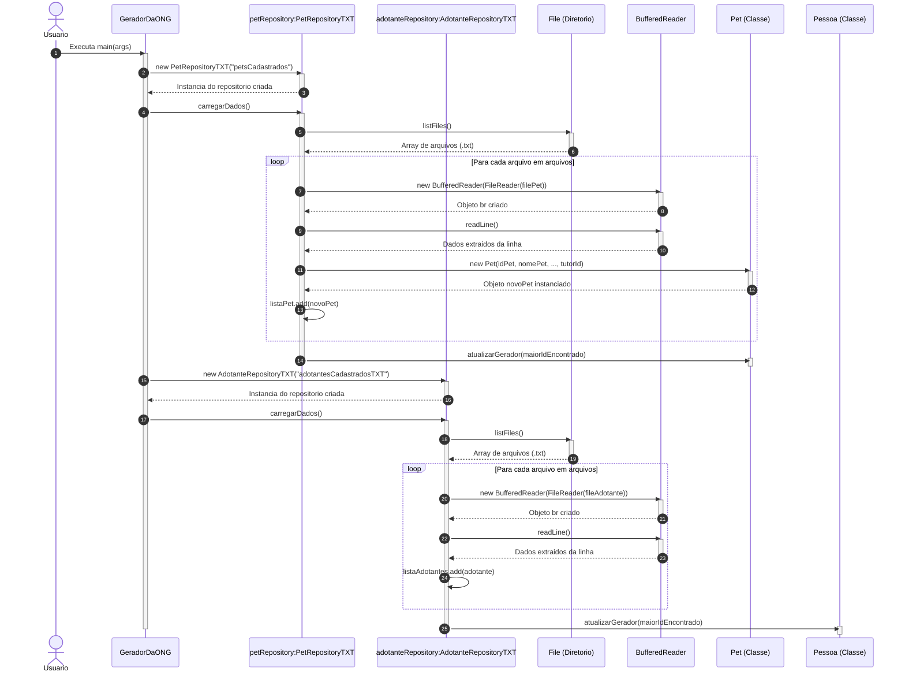
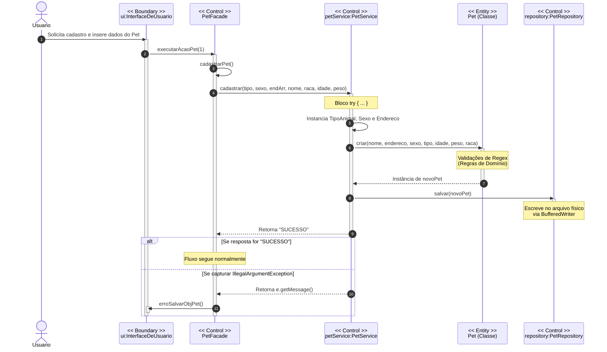
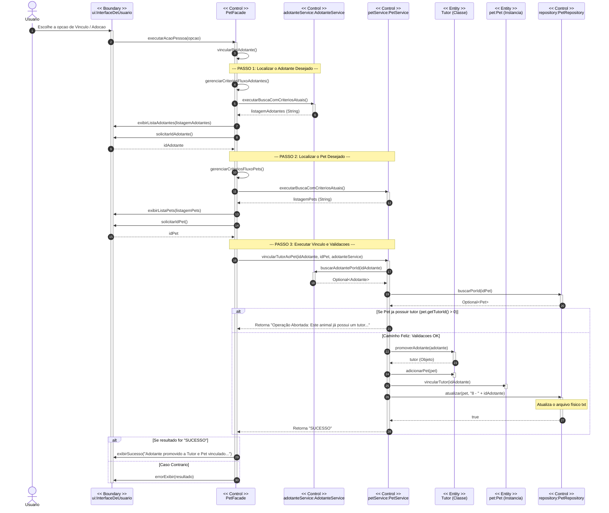
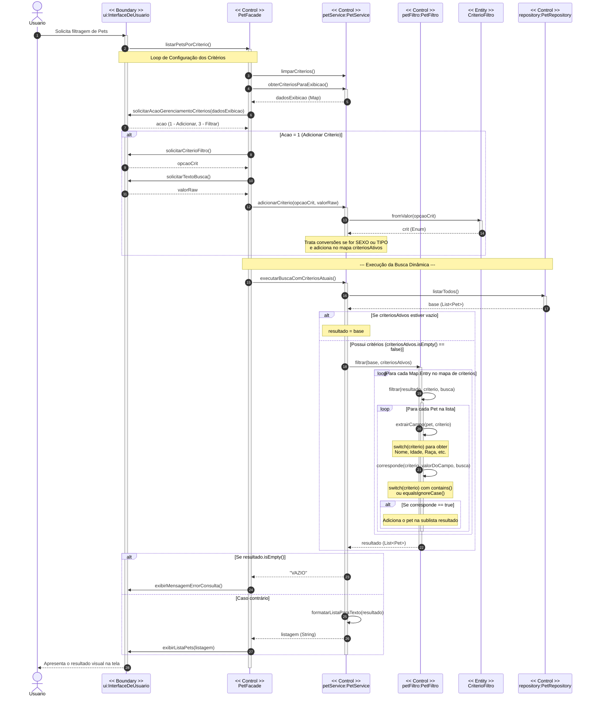

### SD-01: Inicialização do Sistema e Carga Dinâmica de Dados em Memória

### SD-02: Fluxo Padrão de Cadastro e Persistência de Pets

### SD-03: Processo de Adoção (Vincular Tutor ao Pet)

### SD-04: Consulta Dinâmica com Filtros Avançados de Pets
