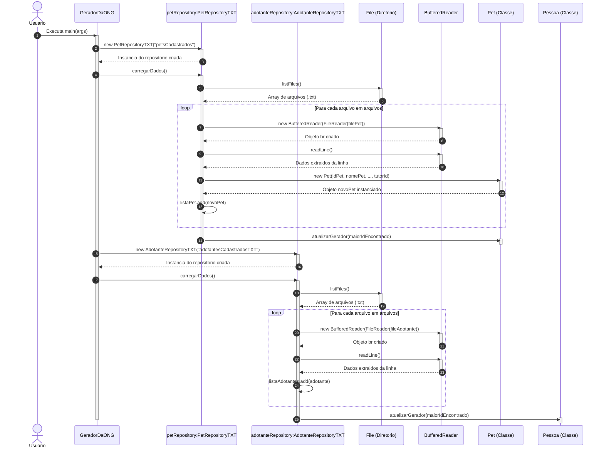
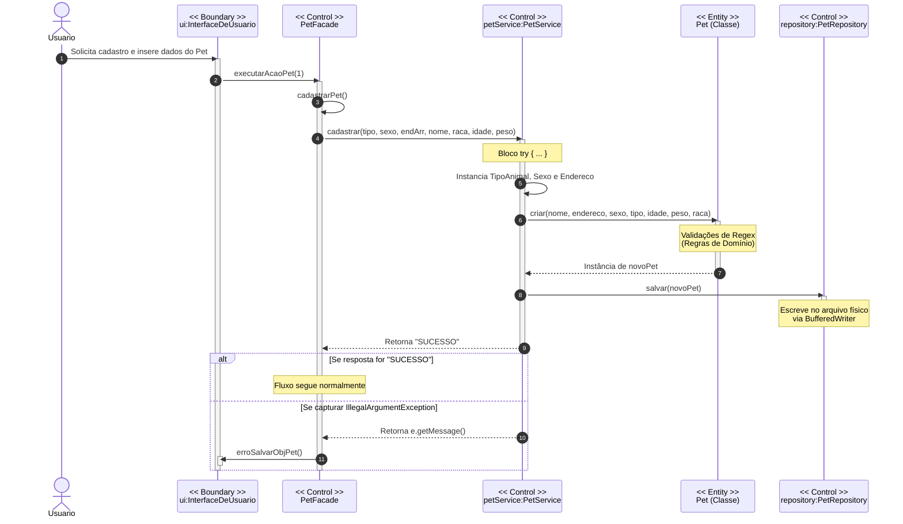

### SD-01: Inicialização do Sistema e Carga Dinâmica de Dados em Memória

```mermaid
sequenceDiagram
    autonumber
    actor Usuario
    participant Main as GeradorDaONG
    participant PetRepo as petRepository:PetRepositoryTXT
    participant AdotanteRepo as adotanteRepository:AdotanteRepositoryTXT
    participant File as File (Diretorio)
    participant BR as BufferedReader
    participant Pet as Pet (Classe)
    participant Pessoa as Pessoa (Classe)

    Usuario->>Main: Executa main(args)
    activate Main

%% CONTEXTO PETS
    Main->>PetRepo: new PetRepositoryTXT("petsCadastrados")
    activate PetRepo
    PetRepo-->>Main: Instancia do repositorio criada
    deactivate PetRepo

    Main->>PetRepo: carregarDados()
    activate PetRepo
    PetRepo->>File: listFiles()
    activate File
    File-->>PetRepo: Array de arquivos (.txt)
    deactivate File

    loop Para cada arquivo em arquivos
        PetRepo->>BR: new BufferedReader(FileReader(filePet))
        activate BR
        BR-->>PetRepo: Objeto br criado
        deactivate BR

        PetRepo->>BR: readLine()
        activate BR
        BR-->>PetRepo: Dados extraidos da linha
        deactivate BR

        PetRepo->>Pet: new Pet(idPet, nomePet, ..., tutorId)
        activate Pet
        Pet-->>PetRepo: Objeto novoPet instanciado
        deactivate Pet

        PetRepo->>PetRepo: listaPet.add(novoPet)
    end

    PetRepo->>Pet: atualizarGerador(maiorIdEncontrado)
    activate Pet
%% Método void: finaliza e desativa sem seta de retorno
    deactivate Pet

%% Fim do carregarDados (void): desativa sem seta de retorno
    deactivate PetRepo

%% CONTEXTO ADOTANTES
    Main->>AdotanteRepo: new AdotanteRepositoryTXT("adotantesCadastradosTXT")
    activate AdotanteRepo
    AdotanteRepo-->>Main: Instancia do repositorio criada
    deactivate AdotanteRepo

    Main->>AdotanteRepo: carregarDados()
    activate AdotanteRepo
    AdotanteRepo->>File: listFiles()
    activate File
    File-->>AdotanteRepo: Array de arquivos (.txt)
    deactivate File

    loop Para cada arquivo em arquivos
        AdotanteRepo->>BR: new BufferedReader(FileReader(fileAdotante))
        activate BR
        BR-->>AdotanteRepo: Objeto br criado
        deactivate BR

        AdotanteRepo->>BR: readLine()
        activate BR
        BR-->>AdotanteRepo: Dados extraidos da linha
        deactivate BR

        AdotanteRepo->>AdotanteRepo: listaAdotantes.add(adotante)
    end

    AdotanteRepo->>Pessoa: atualizarGerador(maiorIdEncontrado)
    activate Pessoa
%% Método void: finaliza e desativa sem seta de retorno
    deactivate Pessoa

%% Fim do carregarDados (void): desativa sem seta de retorno
    deactivate AdotanteRepo

    deactivate Main
```
### SD-02: Fluxo Padrão de Cadastro e Persistência de Pets

```mermaid
sequenceDiagram
    autonumber
    actor Usuario
    participant UI as << Boundary >><br/>ui:InterfaceDeUsuario
    participant Facade as << Control >><br/>PetFacade
    participant Service as << Control >><br/>petService:PetService
    participant PetClass as << Entity >><br/>Pet (Classe)
    participant Repo as << Control >><br/>repository:PetRepository

    Usuario->>UI: Solicita cadastro e insere dados do Pet
    activate UI

    UI->>Facade: executarAcaoPet(1)
    activate Facade
    Facade->>Facade: cadastrarPet()

    Facade->>Service: cadastrar(tipo, sexo, endArr, nome, raca, idade, peso)
    activate Service

    Note over Service: Bloco try { ... }
    Service->>Service: Instancia TipoAnimal, Sexo e Endereco

    Service->>PetClass: criar(nome, endereco, sexo, tipo, idade, peso, raca)
    activate PetClass
    Note over PetClass: Validações de Regex<br/>(Regras de Domínio)
    PetClass-->>Service: Instância de novoPet
    deactivate PetClass

    Service->>Repo: salvar(novoPet)
    activate Repo
    Note over Repo: Escreve no arquivo físico<br/>via BufferedWriter
    deactivate Repo

    Service-->>Facade: Retorna "SUCESSO"
    deactivate Service

    alt Se resposta for "SUCESSO"
        Note over Facade: Fluxo segue normalmente
    else Se capturar IllegalArgumentException
        Service-->>Facade: Retorna e.getMessage()
        Facade->>UI: erroSalvarObjPet()
        activate UI
        deactivate UI
    end

    deactivate Facade
    deactivate UI
```