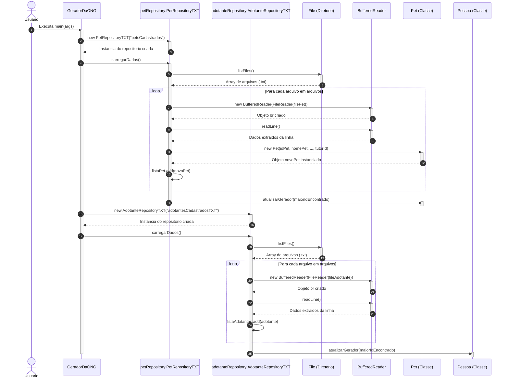

### SD-01: Inicialização do Sistema e Carga Dinâmica de Dados em Memória

```mermaid
sequenceDiagram
    autonumber
    actor Usuario
    participant Main as GeradorDaONG
    participant PetRepo as petRepository:PetRepositoryTXT
    participant AdotanteRepo as adotanteRepository:AdotanteRepositoryTXT
    participant File as File (Diretorio)
    participant BR as BufferedReader
    participant Pet as Pet (Classe)
    participant Pessoa as Pessoa (Classe)

    Usuario->>Main: Executa main(args)
    activate Main

%% CONTEXTO PETS
    Main->>PetRepo: new PetRepositoryTXT("petsCadastrados")
    activate PetRepo
    PetRepo-->>Main: Instancia do repositorio criada
    deactivate PetRepo

    Main->>PetRepo: carregarDados()
    activate PetRepo
    PetRepo->>File: listFiles()
    activate File
    File-->>PetRepo: Array de arquivos (.txt)
    deactivate File

    loop Para cada arquivo em arquivos
        PetRepo->>BR: new BufferedReader(FileReader(filePet))
        activate BR
        BR-->>PetRepo: Objeto br criado
        deactivate BR

        PetRepo->>BR: readLine()
        activate BR
        BR-->>PetRepo: Dados extraidos da linha
        deactivate BR

        PetRepo->>Pet: new Pet(idPet, nomePet, ..., tutorId)
        activate Pet
        Pet-->>PetRepo: Objeto novoPet instanciado
        deactivate Pet

        PetRepo->>PetRepo: listaPet.add(novoPet)
    end

    PetRepo->>Pet: atualizarGerador(maiorIdEncontrado)
    activate Pet
%% Método void: finaliza e desativa sem seta de retorno
    deactivate Pet

%% Fim do carregarDados (void): desativa sem seta de retorno
    deactivate PetRepo

%% CONTEXTO ADOTANTES
    Main->>AdotanteRepo: new AdotanteRepositoryTXT("adotantesCadastradosTXT")
    activate AdotanteRepo
    AdotanteRepo-->>Main: Instancia do repositorio criada
    deactivate AdotanteRepo

    Main->>AdotanteRepo: carregarDados()
    activate AdotanteRepo
    AdotanteRepo->>File: listFiles()
    activate File
    File-->>AdotanteRepo: Array de arquivos (.txt)
    deactivate File

    loop Para cada arquivo em arquivos
        AdotanteRepo->>BR: new BufferedReader(FileReader(fileAdotante))
        activate BR
        BR-->>AdotanteRepo: Objeto br criado
        deactivate BR

        AdotanteRepo->>BR: readLine()
        activate BR
        BR-->>AdotanteRepo: Dados extraidos da linha
        deactivate BR

        AdotanteRepo->>AdotanteRepo: listaAdotantes.add(adotante)
    end

    AdotanteRepo->>Pessoa: atualizarGerador(maiorIdEncontrado)
    activate Pessoa
%% Método void: finaliza e desativa sem seta de retorno
    deactivate Pessoa

%% Fim do carregarDados (void): desativa sem seta de retorno
    deactivate AdotanteRepo

    deactivate Main
```

